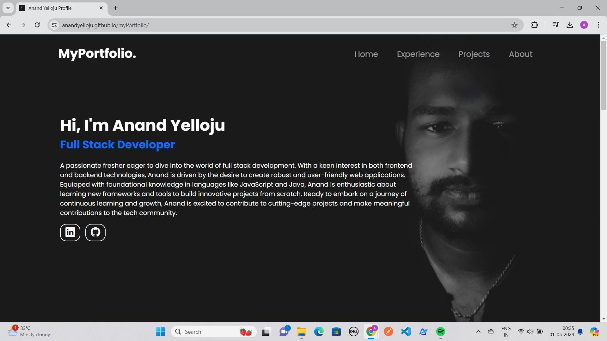
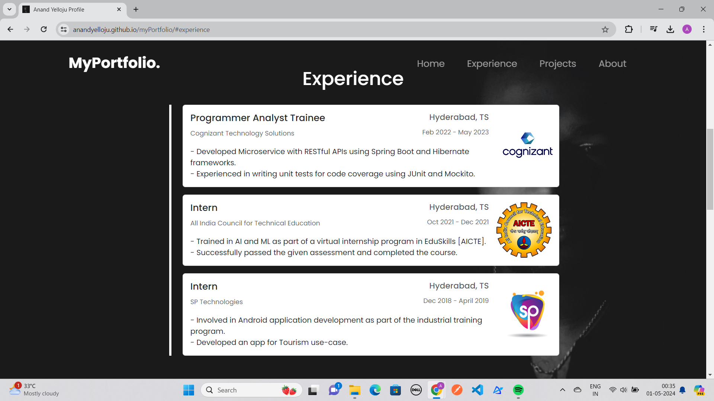
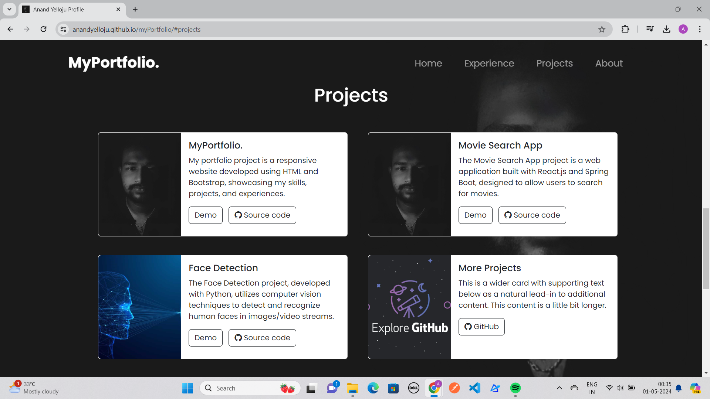
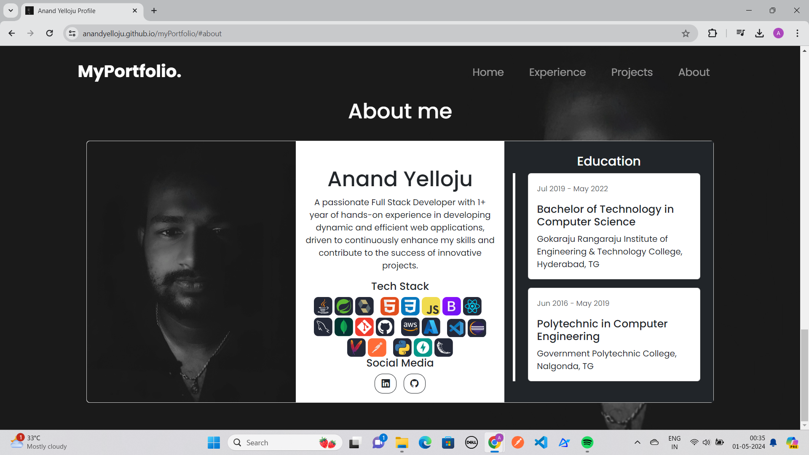

# My Portfolio

A personal portfolio website built with Bootstrap CSS and HTML. Showcases experience, skills, and projects information.

**Live Demo -** https://anandyelloju.github.io/my-portfolio/

## Table of Contents

- [Screenshots](#screenshots)
- [Installation](#installation)
- [Usage](#usage)
- [Features](#features)
- [Technologies Used](#technologies-used)
- [Contributing](#contributing)
- [Credits](#credits)
- [License](#license)
<!--
## Screenshots






## Installation

To set up this project locally, follow these steps:
1. Clone the repository:   
  ```
  git clone https://github.com/your-username/myportfolio.git
  ```
2. Navigate to the project directory:
  ```
  cd myportfolio
  ```
3. Open the index.html file in your web browser to view the portfolio.

## Usage

After installation, you can view and edit the project directly in your web browser. The portfolio includes several sections:

- **Home:** Introduction.
- **Experience:** Details about your professional experience.
- **Projects:** Showcase of your projects with descriptions and links.
- **About:** Summary of who you are, Education, and Overview of your technical skills.
- **Connect:** Socials for visitors to get in touch with you.

**Example:** Adding a New Experience\
To add a new Experience to the portfolio, update the index.html file as follows:

```
<div class="card ms-4 mb-3">
    <div class="row g-0">
        <div class="col-md-10">
            <div class="card-body">
                <h5 class="card-title">Programmer Analyst Trainee <small class="text-muted float-end">Hyderabad, TS</small></h5>
                <p class="card-text"><small class="text-muted">Cognizant Technology Solutions</small><small class="text-muted float-end">Feb 2022 - May 2023</small></p>
                <p class="card-text">- Developed Microservice with RESTful APIs using Spring Boot and Hibernate frameworks. 
                <br>- Experienced in writing unit tests for code coverage using JUnit and Mockito. </p>
            </div>
        </div>
        <div class="col-md-2">
            
        </div>
    </div>
</div>
```

**Example:** Adding a New Project\
To add a new project to the portfolio, update the index.html file as follows:

```
<div class="col">
    <div class="card mb-3" style="max-width: 540px;">
        <div class="row g-0">
            <div class="col-md-4">
                
            </div>
            <div class="col-md-8">
                <div class="card-body">
                    <h5 class="card-title">MyPortfolio.</h5>
                    <p class="card-text">My portfolio project is a responsive website developed using HTML and Bootstrap, showcasing my skills, projects, and experiences. </p>                              
                    <a href="#" class="btn btn-outline-dark">Demo</a> &nbsp;
                    <a href="https://github.com/AnandYelloju/myPortfolio" class="btn btn-outline-dark"><i class="bi bi-github"></i> Source code</a>
                </div>
            </div>
        </div>
    </div>
</div>
```

## Features

- **Responsive Design:** Optimized for both desktop and mobile devices.
- **Project Showcase:** Highlight your best projects with descriptions and links.

## Technologies Used

- **HTML:** Markup language for creating web pages.
- **CSS:** Stylesheet language for designing web pages.
- **Bootstrap:** CSS framework for responsive design.

[](https://skillicons.dev)

## Contributing

Contributions are always welcome! - If you have suggestions or improvements.

## Credits

- [Bootstrap](https://getbootstrap.com/docs/5.1/getting-started/introduction/) for the styling framework.
- [HTML](https://developer.mozilla.org/en-US/docs/Web/HTML) for structuring a web page.

## License

This project is licensed under the [MIT License](https://choosealicense.com/licenses/mit/) - see the [LICENSE](https://github.com/anandyelloju/my-portfolio/blob/main/LICENSE) file for details.
-->
